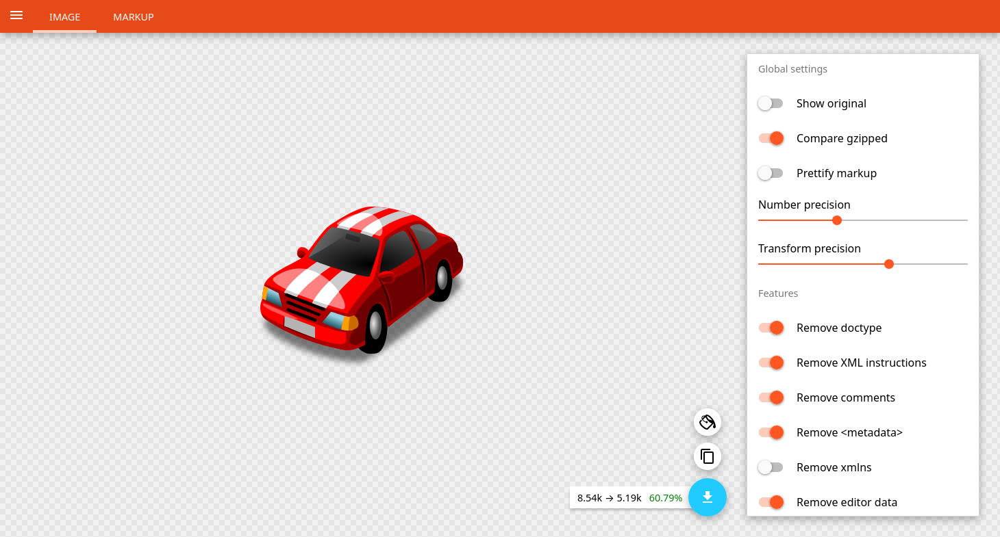

# OXVGUI

[OXVGUI](https://oxvgui.jonasgeiler.com/) is an **[OXVG](https://github.com/noahbald/oxvg)** **U**ser **I**nterface, aiming to expose the majority, if not all the configuration options of OXVG.

This is a fork of [SVGOMG](https://jakearchibald.github.io/svgomg/).

## Screenshot



## Feature requests

[Check out the issues](https://github.com/jonasgeiler/oxvgui/issues) to see what's planned, or suggest ideas of your own!

## Local development

Install dependencies:

```sh
pnpm install
```

Run development server:

```sh
pnpm run dev
```
