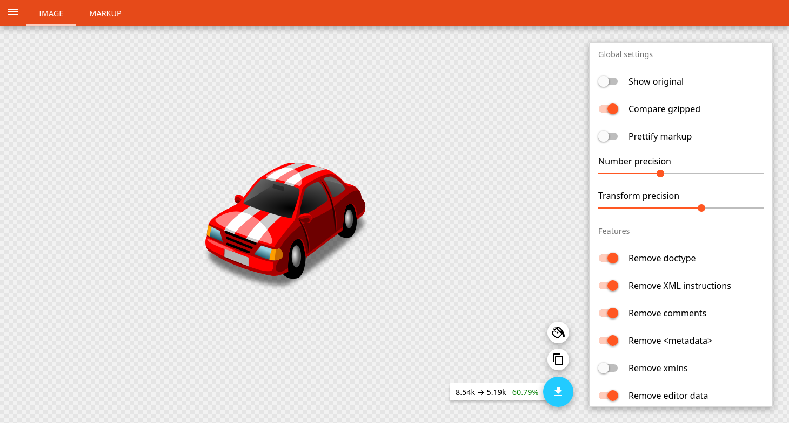

# OXVGUI
> Fast, web-based [OXVG][] interface to compress, optimize, and minify SVG images. Reduce file size, clean graphics, and preview changes instantly!

[OXVGUI][] is an **[OXVG][]** **U**ser **I**nterface, aiming to expose the majority, if not all the configuration options of OXVG.

This is a fork of [SVGOMG][] using [OXVG][] instead of [SVGO][], which aims to be faster and more accurate than SVGO and is written in Rust.

## Screenshot



## Feature requests

[Check out the issues](https://github.com/jonasgeiler/oxvgui/issues) to see what's planned, or suggest ideas of your own!

## Local development

Install dependencies:

```sh
pnpm install
```

Run development server:

```sh
pnpm run dev
```

[OXVGUI]: https://oxvgui.jonasgeiler.com/
[OXVG]: https://github.com/noahbald/oxvg
[SVGOMG]: https://jakearchibald.github.io/svgomg/
[SVGO]: https://svgo.dev/
